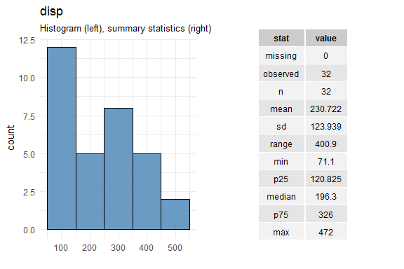
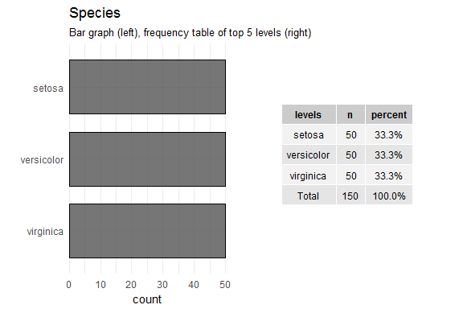
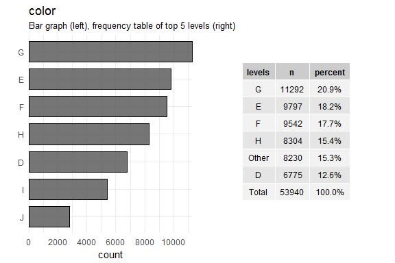

edat plot examples
================
Emile Latour
2018-02-14

<!------ Thanks for any contributions! Please edit the .Rmd, the .md is a byproduct of the .Rmd! --------->
Load the script for the EEDA plots
==================================

``` r
source(
  here::here("make-edat-plots.R")
  )
```

Examples of `plot_cont()`
=========================

The `plot_cont()` function will plot a histogram and table of summary statistics for **continuous** variables. As one of the inputs, the user can specify the method to use for creating histogram bins.

Below are some examples using the `mtcars` data set.

``` r
plot_cont(data = mtcars, var = disp)
```



``` r
plot_cont(data = mtcars, var = disp, binw_select = "Sturges")
```


``` r
plot_cont(data = mtcars, var = disp, binw_select = "Scott")
```


``` r
plot_cont(data = mtcars, var = disp, binw_select = "Hadley")
```


Examples of `plot_categ()`
==========================

The `plot_categ()` function creates a bar plot and frequency table for **categorical** variables.

Here is another example using the the `mtcars` data set.

``` r
mt2 <- mtcars %>% 
  mutate(cyl = factor(cyl))

plot_categ(data = mt2, var = cyl)
```


Or another using th `iris` data set.

``` r
plot_categ(data = iris, var = Species)
```



Example of `make_plots()`
=========================

The `make_plots()` function takes a data set as an input and will apply either `plot_cont()` or `plot_categ()` depending on the variable class.

An example using the `diamonds` data set fromm the `ggplot2` package.

``` r
make_plots(data = diamonds)
```



It works with the `%>%` oprator
===============================

Note that all three functions are pipeable using `dplyr`. So if instead of the entire data set, you wanted to plot a subset:

``` r
diamonds %>% 
  dplyr::select(carat, color, clarity, price) %>% 
  make_plots(.)
```


