EEDA examples
================
Emile Latour
2018-02-13

<!------ Thanks for any contributions! Please edit the .Rmd, the .md is a byproduct of the .Rmd! --------->
Load the script for the EEDA plots
==================================

``` r
source(
  here::here("make-eeda-plots.R")
  )
```

Examples of `plot_cont()`
=========================

Usisng the `mtcars` data set.

``` r
plot_cont(data = mtcars, var = disp)
```

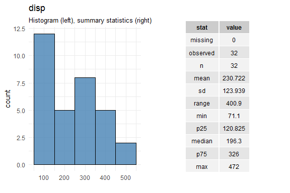

``` r
plot_cont(data = mtcars, var = disp, binw_select = "Sturges")
```


``` r
plot_cont(data = mtcars, var = disp, binw_select = "Scott")
```


``` r
plot_cont(data = mtcars, var = disp, binw_select = "Hadley")
```

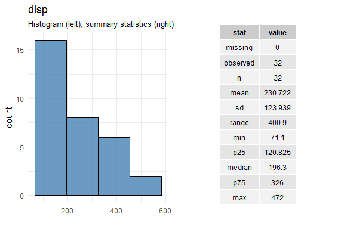

Examples of `plot_categ()`
==========================

Again, using the `mtcars` data set.

``` r
mt2 <- mtcars %>% 
  mutate(cyl = factor(cyl))

plot_categ(data = mt2, var = cyl)
```

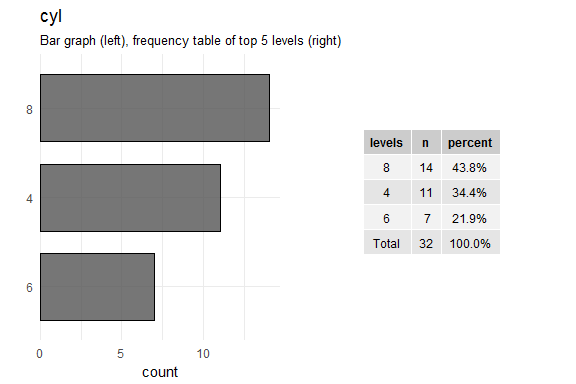

Example of make\_plots()
========================

Using the `diamonds` data set fromm the `ggplot2` package.

``` r
make_plots(data = diamonds)
```

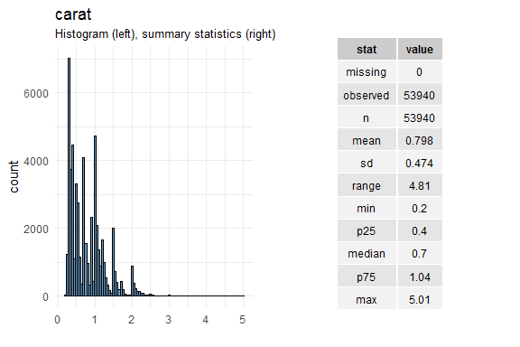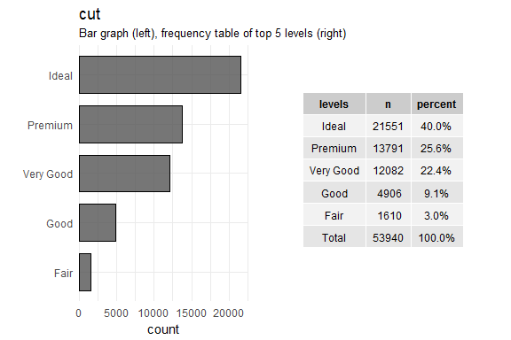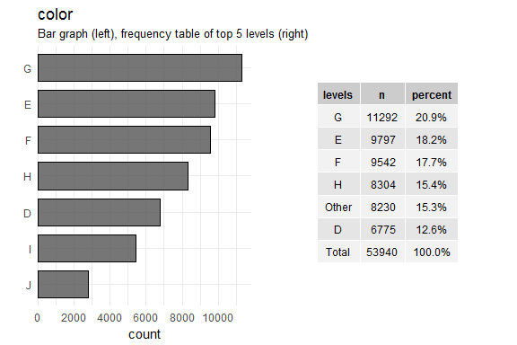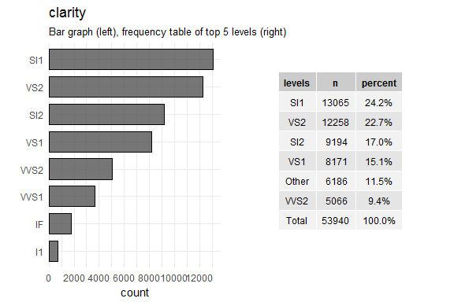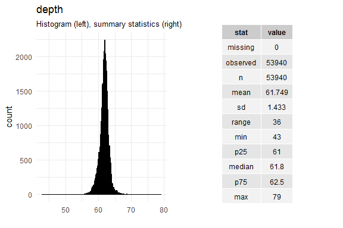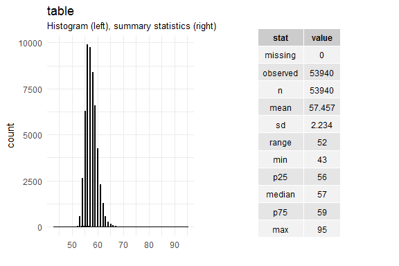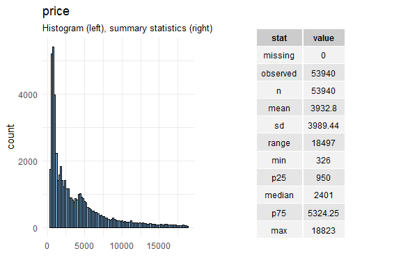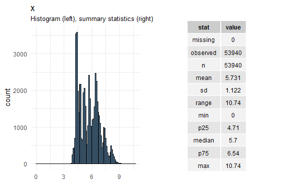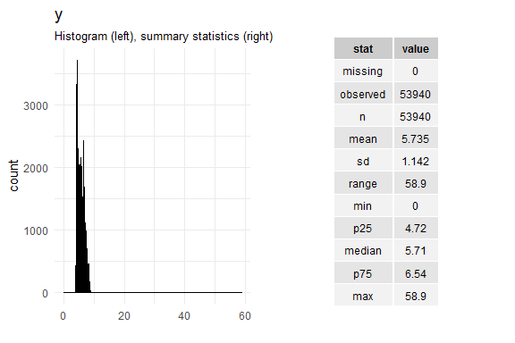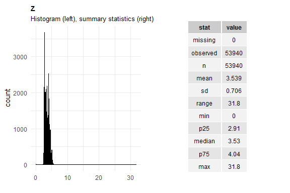
